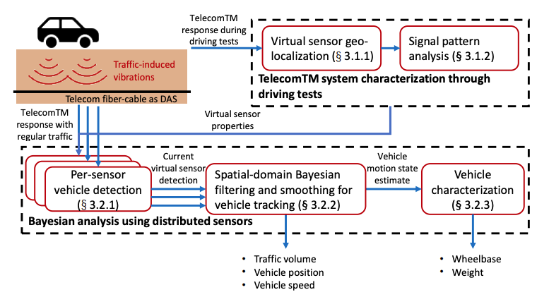

# TelecomTM: A Fine-Grained and Ubiquitous Traffic Monitoring System Using Pre-Existing Telecommunication Fiber-Optic Cables as Sensors


This is the repository for the following paper. If you use this implementation, please cite our paper:

>* Liu, J., Yuan, S., Dong, Y., Biondi, B., & Noh, H. Y. (2023). TelecomTM: A Fine-Grained and Ubiquitous Traffic Monitoring System Using Pre-Existing Telecommunication Fiber-Optic Cables as Sensors. arXiv preprint arXiv:2305.03172.

[[paper]](https://arxiv.org/abs/2305.03172)

### Description



We introduce the TelecomTM system that uses pre-existing telecommunication fiber-optic cables as virtual strain sensors to sense vehicle-induced ground vibrations for fine-grained and ubiquitous traffic monitoring and characterization. Here we call it a virtual sensor because it is a software-based representation of a physical sensor. Due to the extensively installed telecommunication fiber-optic cables at the roadside, our system using redundant dark fibers enables to monitor traffic at low cost with low maintenance. Many existing traffic monitoring approaches use cameras, piezoelectric sensors, and smartphones, but they are limited due to privacy concerns and/or deployment requirements. 

Previous studies attempted to use telecommunication cables for traffic monitoring, but they were only exploratory and limited to simple tasks at a coarse granularity, e.g., vehicle detection, due to their hardware constraints and real-world challenges. In particular, those challenges are 1) unknown and heterogeneous properties of virtual sensors and 2) large and complex noise conditions. To this end, our TelecomTM system first characterizes the geographic location and analyzes the signal pattern of each virtual sensor through driving tests. We then develop a spatial-domain Bayesian filtering and smoothing algorithm to detect, track, and characterize each vehicle. Our approach uses the spatial dependency of multiple virtual sensors and Newton's laws of motion to combine the distributed sensor data to reduce uncertainties in vehicle detection and tracking. 

In our real-world evaluation on a two-way traffic road with 1120 virtual sensors, TelecomTM achieved 90.18% vehicle detection accuracy, 27× and 5× error reduction for vehicle position and speed tracking compared to a baseline method, and ±3.92% and ±11.98% percent error for vehicle wheelbase and weight estimation, respectively.

### Code Usage
```
git clone https://github.com/jingxiaoliu/TelecomTM.git

```
- Run the demo example with
```
jupyter notebook vehicle_tracking_demo.ipynb
```
### Contact
Feel free to send any questions to:
- [Jingxiao Liu](mailto:liujx@stanford.edu)
